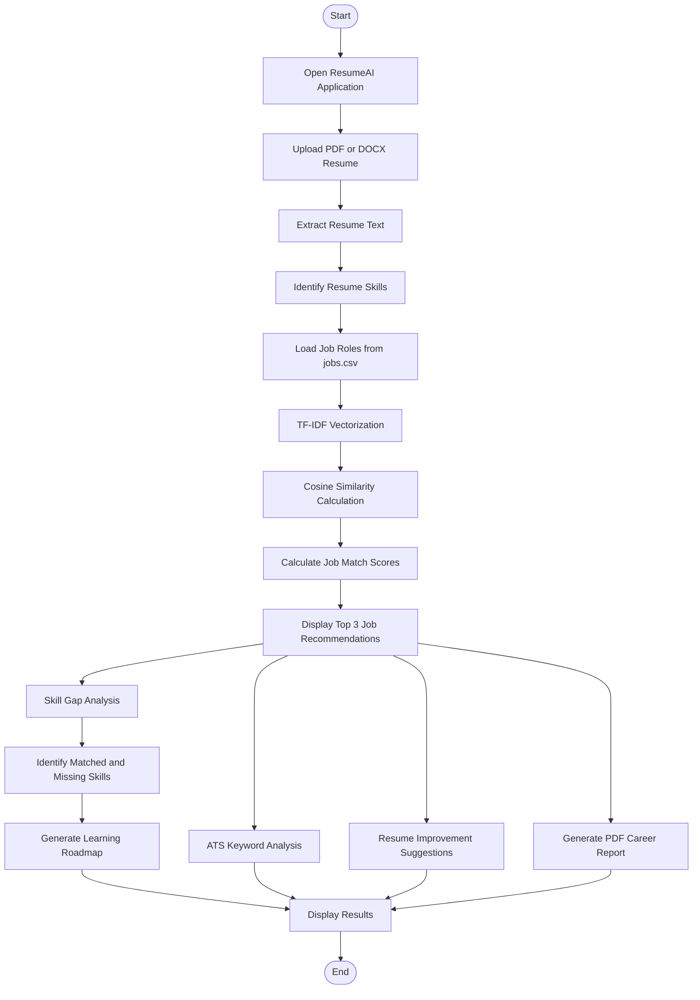

# ResumeAI – Project Workflow

```mermaid
flowchart TD
    A([Start]) --> B[Open ResumeAI Application]
    B --> C[Upload PDF or DOCX Resume]
    C --> D[Extract Resume Text]
    D --> E[Identify Resume Skills]
    E --> F[Load Job Roles from jobs.csv]
    F --> G[TF-IDF Vectorization]
    G --> H[Cosine Similarity Calculation]
    H --> I[Calculate Job Match Scores]
    I --> J[Display Top 3 Job Recommendations]
    J --> K[Skill Gap Analysis]
    K --> L[Identify Matched and Missing Skills]
    L --> M[Generate Learning Roadmap]
    J --> N[ATS Keyword Analysis]
    J --> O[Resume Improvement Suggestions]
    J --> P[Generate PDF Career Report]
    M --> Q[Display Results]
    N --> Q
    O --> Q
    P --> Q
    Q --> R([End])
```

